==============
User Interface
==============

Terminology
===========
Shape-Out 2 introduces several terms in the user interface that also play
a role in data analysis and are consequently used in the entire code base.

basin
    A source of feature data stored in datasets other than the one opened
    by the user. For an overview on basins, please take a look at the
    :ref:`dclab documentation <dclab:sec_av_basins>`. When exporting data
    from Shape-Out, the original dataset can be referenced via basins,
    allowing you to reduce data redundancy.

block matrix
    The :ref:`sec_block_matrix` is a visualization of the analysis
    pipeline. It is divided into data matrix (filters) and plot matrix (plots).

dataslot or slot
    A slot holds all information about a measurement: the path to the
    .rtdc file, fluorescence labels, display color, etc. (see the
    *Dataset* tab in the :ref:`sec_analysis_view`).

filter
    A filter is a set of filtering options (box filter, polygon filter,
    downsampling, etc.) that can be applied to a slot (see the
    *Filter* tab in the :ref:`sec_analysis_view`). Filters can be exported
    and imported again in Shape-Out 2 (.sof file format).

filter ray
    A filter ray is a list of filters that can be applied to a slot.
    In Shape-Out 2, each row in the :ref:`sec_block_matrix` contains
    one filter ray.

pipeline
    A pipeline consists of all filters, slots, plots, and the filter rays
    (the filter selection) applied to each slot. A Shape-Out 2 session file
    (.so2) stores all information necessary to rebuild a pipeline.

plot
    A plot is a user-defined visualization of a slot/filter ray combination.

Basic usage
===========
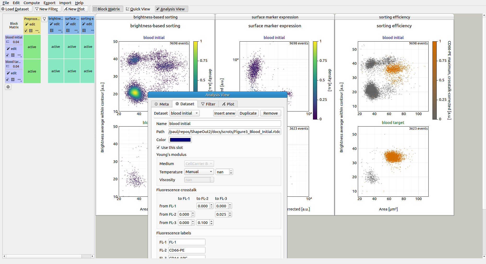

The user interface is split into several parts: the menu bar and the tool
bar at the top, the Block Matrix on the left, and the Workspace on the right
(example data taken from :cite:`NawUrb2019`, :cite:`NawUrb2019data`).

Menu bar and tool bar
---------------------
The menu bar is used for session management (File menu)
and makes additional functionalities available, such as batch
processing, data statistics, data export, plot export, or filter import/export.
The tool bar contains shortcuts for adding new datasets,
filters, or plots (left part) and allows to hide/show the
:ref:`sec_block_matrix` as well as the :ref:`sec_quick_view` and
:ref:`sec_analysis_view` windows (right part).

.. _sec_block_matrix:

Block Matrix
------------
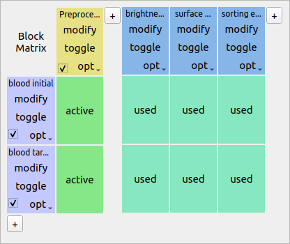

The Block Matrix gives an overview of the current analysis
pipeline. Each row represents a dataset (purple). The columns represent
either filters (yellow) or plots (blue) of your pipeline.
You can change the order of datasets via the *Edit|Change dataset order*
menu bar entry.

You can perform dataset operations in the purple rectangular area
at the beginning of each row: To modify a dataset, click on the *edit*
button. You can duplicate, insert anew (unmodified), or remove datasets
using the dropdown menu. You can also exclude a dataset from an analysis
via the check box.

Filters can also be modified, copied, removed and disabled.
By default, all filters are disabled when they are created. To apply a filter
to a dataset, click on the corresponding matrix element. The element changes
its color from gray (incactive) to green (active). In Shape-Out, all
filters that are applied to a dataset are called a **filter ray**.
In the above example, the filter ray only consists of a single filter for each
dataset. Filter rays may be different for each dataset. 

By holding down the *Shift* key while clicking on a matrix element, you
can activate the :ref:`Quick View <sec_quick_view>` for the specific
dataset (with filters applied up until the selected column). The block matrix
element is then colored pink.

To add a plot, click on the *New Plot* button in the tool bar. This adds
a plot column with a blue header to the Block Matrix and creates an empty
plot window. You can add datasets to your plot by clicking on the
corresponding matrix elements. In the above example, both datasets are
being used in all three plots. 

The modification of datasets, filters, and plots is discussed below.

Workspace
---------
The Workspace is designed as an infinite scrollable area and contains all
plot windows as well as the :ref:`sec_quick_view` and Analysis View windows.

.. _sec_analysis_view:

Analysis View
-------------
The analysis view consists of seven tabs that allow you to inspect the
datasets loaded and to perform filtering and plotting actions.

Meta
....
The **Meta** tab displays all metadata of the selected dataset that
are stored in the original .rtdc file. Here you can check and compare
measurement and postprocessing parameters.

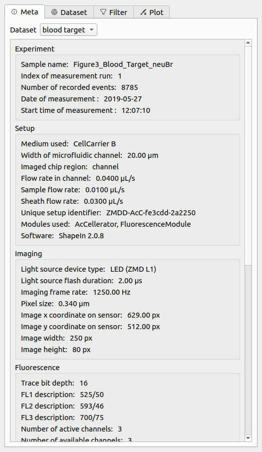

    Meta tab in the Analysis View.

Basins
......
The **Basins** tab yields insight into the basins that are loaded for
a dataset. Find out more about basins in the
:ref:`dclab documentation <dclab:sec_av_basins>`.

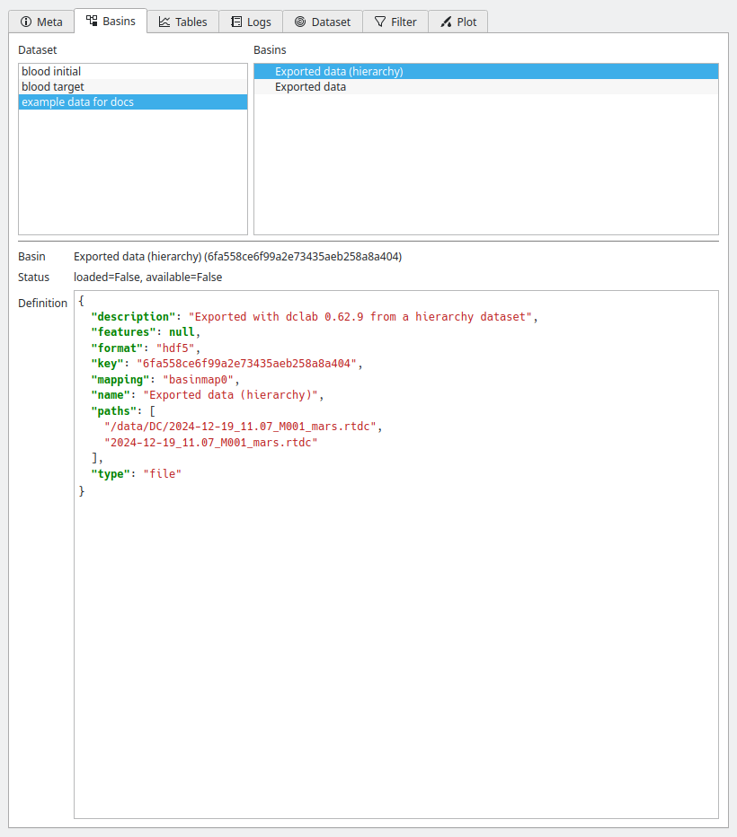

    Basins tab in the Analysis View.

Tables
......
The **Tables** tab allows you to visualize additional telemetry recorded
during the measurement. You can use it for quality control and to identify
reasons for temporal trends within a dataset.

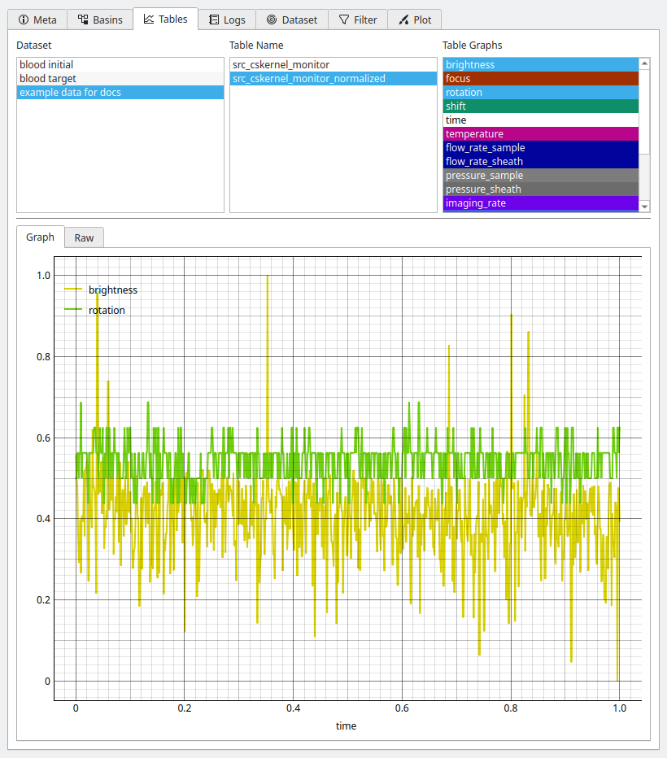

    Tables tab in the Analysis View.

Logs
....
The **Logs** tab gives access to all logs stored in a dataset.

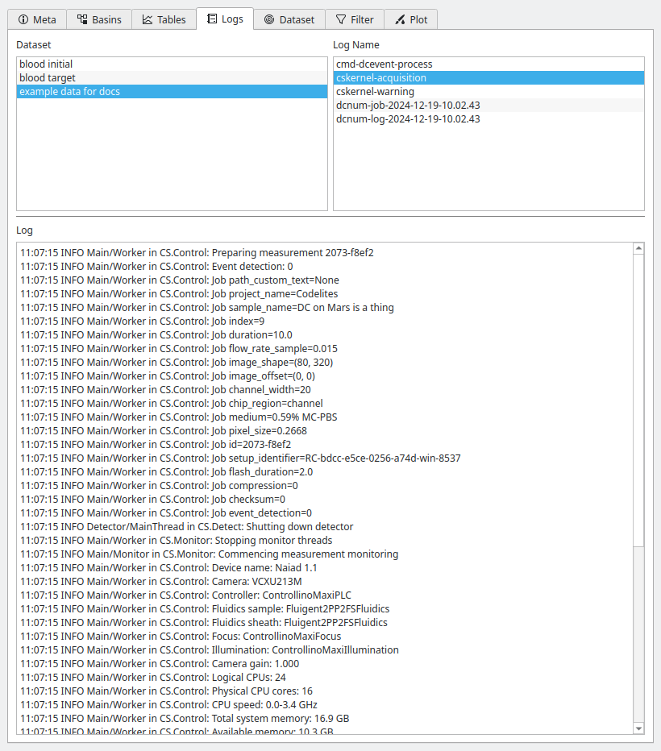

    Logs tab in the Analysis View.

Dataset
.......
The **Dataset** tab allows to
specify additional metadata, such as unique colors used for plotting and
additional metadata for computing the Young's modulus or correcting
for fluorescence cross-talk. It also allows to specify fluorescence
channel labels that will then be used for labeling the axes of plots.

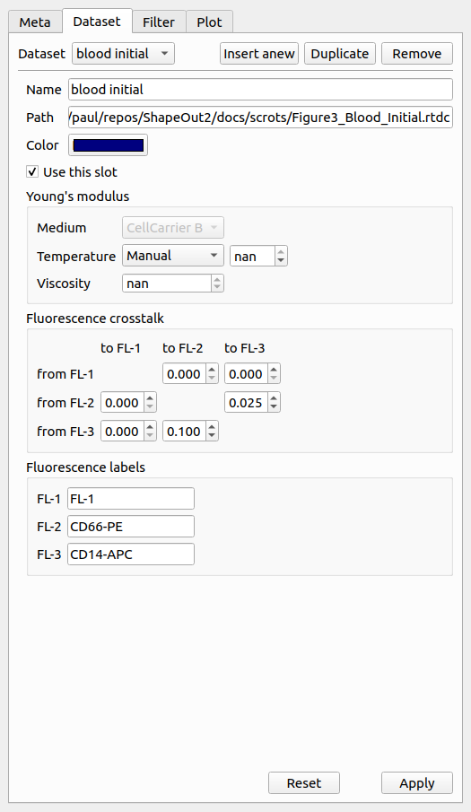

    Dataset tab in the Analysis View.

Filter
......
The **Filter** tab is used to modify the filters of the pipeline.
New box filters can be added by selecting *Choose box filters...*.
Polygon filters are created in the :ref:`sec_quick_view` window.

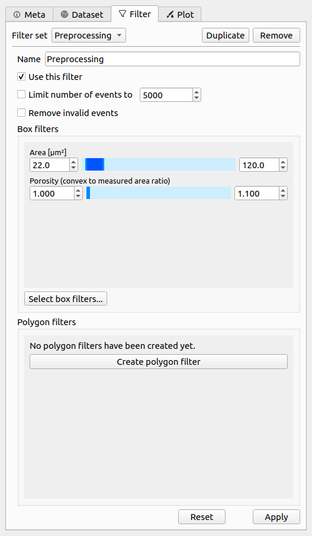

    Filter tab in the Analysis View.

Plot
....
The **Plot** tab allows to specify all plotting parameters. Please
take special note of the *Division* option in the *Layout* section (defines
the arrangement of the subplots) and the *Marker hue* option in the
*Scatter plot* section (allows you the specify whether the scatter
data points are colored according to a kernel density estimate (KDE),
another feature dimension, or the dataset color specified in the
*Dataset* tab). In this example, contour plots are not used.

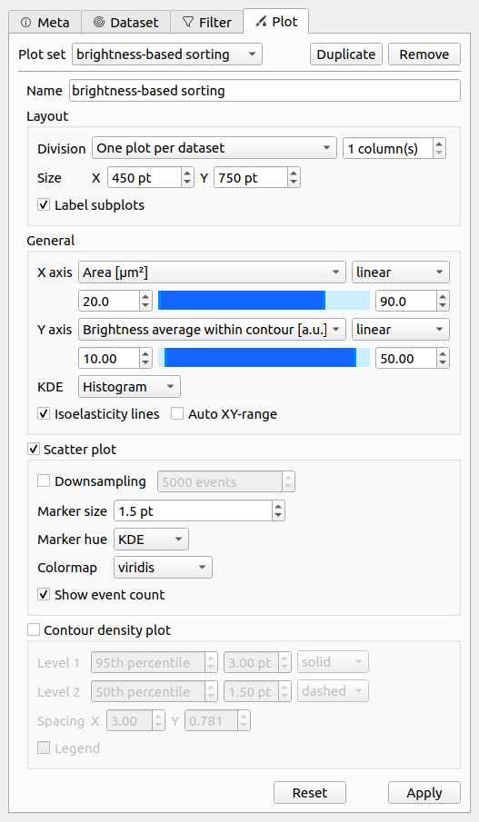

.. _sec_quick_view:

Quick View
----------
The Quick View is meant for dataset exploration. It consists of a scatter plot
on the left (left click for panning and right-click for zooming) and a set of
tool panels that are accessible via the corresponding tool buttons on the right.

Use the **Plot** panel to define all plot parameters. It also displays
common statistics of the two features plotted. The drop down menus for the
`X` and `Y` axes list the available features for the current dataset. The
background color for each of the features is an indicator for the feature
availability:

- *green*: The feature data are present in the current dataset or are
  already computed.
- *blue*: The feature data are part of another dataset,
  a :ref:`basin <dclab:sec_av_basins>`, which may at a remote location
  (e.g. on `DCOR <https://dcor.mpl.mpg.de/>`_) or on the local file system.
- *orange*: The feature data must be computed before it can be displayed. The
  feature is an :ref:`ancillary feature <dclab:sec_features_ancillary>`.

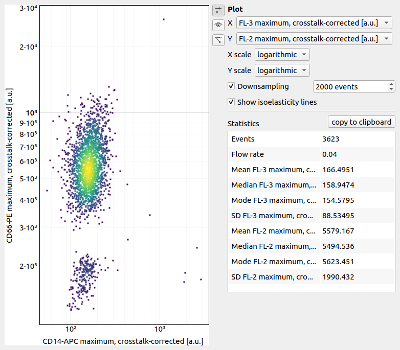

The **Event** panel displays all parameters of an individual event. You can
select single events by clicking in the scatter plot or by scrolling through
the *Index* spin control. If available, the event image is shown alongside the
fluorescence trace of the event. All features of the event are listed in a
separate tab.

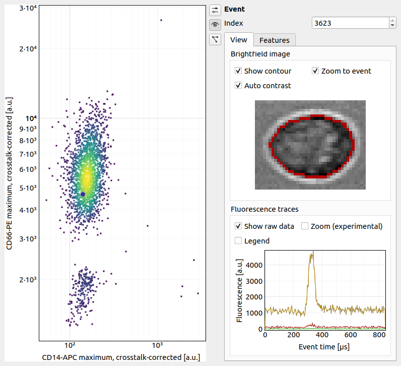

The **Polygon Filter** panel allows you to create and modify polygon filters.
When the panel is active you can move the mouse pointer across the scatter
plot and the image of the event closest to the mouse pointer is displayed.

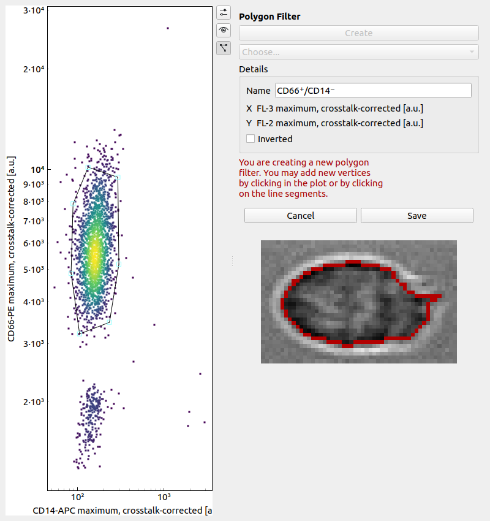
