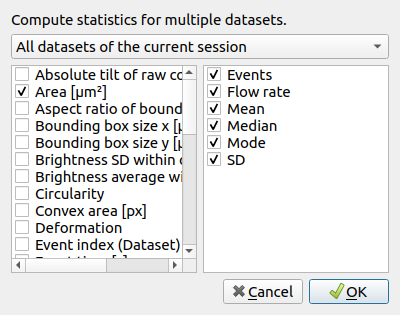
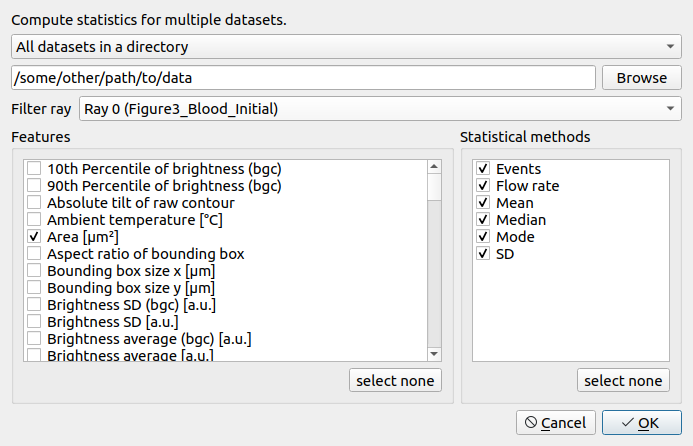

.. _sec_qg_batch_stats:

=======================
Export statistical data
=======================

The :ref:`Quick View window <sec_quick_view>` quantifies the statistics for
the features shown there. If you need access to statistics for more features of
a dataset or if you need to quantify the statistics for multiple datasets
on disk, you can use the *Statistics* tool available via the *Compute* menu. 

.. _qg_statistics_init:

    Statistics export of current session

There are two modes of operation. The first mode exports statistical data
from the current session (:numref:`qg_statistics_init`).
Statistics are always computed after the filter
ray has been applied. You may select the features in the table on the
left and the desired statistics in the table on the right.

.. _qg_statistics_folder:

    Compute statistics for other data

The second mode computes statistics for .rtdc data on disk
(:numref:`qg_statistics_folder`).
Select the *All datasets in a directory* option and (optionally) a filter ray
from the current session that you would like to apply before computing the
statistics.

Note that statistics may not be available for all selected features in all
datasets. In such a case, statistics are exported as *nan* values in the
resulting .tsv file.
