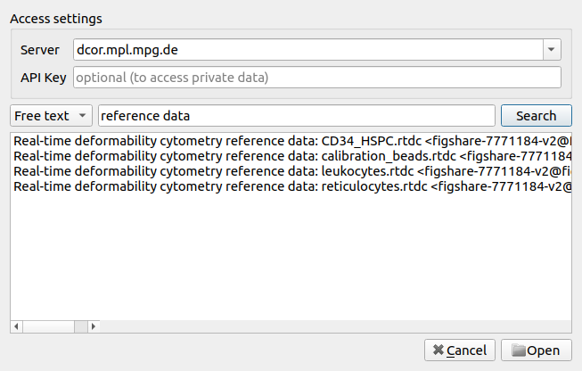

.. _sec_qg_dcor:

===================
Accessing DCOR data
===================

The `deformability cytometry open repository (DCOR)
<https://dcor.mpl.mpg.de>`_ allows you to upload and access RT-DC
datasets online (internet connection required). In Shape-Out 2, you
can access parts of the dataset (e.g. just two features) without
downloading the entire data file (which includes image, contour, and
traces information). This saves disk space and time when accessing
large datasets.

.. _qg_dcor_dlg:

    Dialog for loading DCOR data.

In the *File* menu, choose *Load DCOR data*. A dialog 
(:numref:`qg_dcor_dlg`) lets you search data in the DCOR repository.

.. note::

    If you need to access private data, you have to specify your
    personal API key in the preferences dialog (via the *Edit* menu).
    There, you can also specify which server you wish to connect to.
    You can find your personal API Key in your user pofile page after
    you logged in (e.g. at https://dcor.mpl.mpg.de).

You can choose between a free text search (dataset and resource names,
tags, etc.) and an identifier search (dataset and resource identifiers).
After clicking the *Search* button, you may select the resources you
wish to load into your sesssion in the list view below. Then, click
*Add to session* to load the data.
