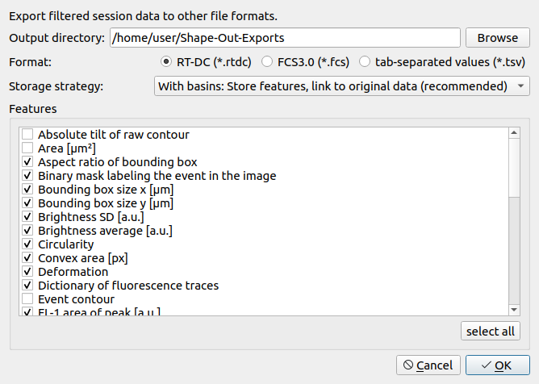

.. _sec_qg_export_data:

==============
Export DC data
==============

Use cases
=========
Sometimes you would like to thin out the number of events or features in a dataset
and export the result to a file. For instance, Shape-Out can export your DC data to the
`flow cytometry standard (.fcs) <https://en.wikipedia.org/wiki/Flow_Cytometry_Standard>`_
file format or to tab-separated values (.tsv) files for data analysis in other
software. If you export to the .rtdc file format, you will stay in the DC
ecosystem, allowing you to make use of dclab and Shape-Out or other software
that can interface with HDF5 data. Since Shape-Out 2.22.0, it is also possible
to export event images as a video file.

.. _qg_export_data:

    Data export for current session

Export options
==============
If you export to the .rtdc file format, you have several options that allow
you to fine-tune what should be stored in the output file:

Features
    The .rtdc file format supports non-scalar feature data such as
    *image* and *trace*. Consequently, these features are only available in the
    list when you select the .rtdc file format. Note that the features that
    are selected by default are those that do not require any additional
    computation time before the export can take place. If you select ancillary
    features such as *volume*, the time required to perform the export will be
    longer.

Storage strategy
    Since Shape-Out 2.16 and with the introduction of :ref:`basins <dclab:sec_av_basins>`
    (which tell dclab/Shape-Out where to find features belonging to the same dataset in
    other locations) in dclab 0.58.0, you can select a storage strategy. The storage
    strategy defines whether features and/or basins are stored in the output file.

    - No basins: This is the behavior in earlier versions of Shape-Out. Only
      the selected features are written to the .rtdc file. Use this option
      if you are certain that you do not want basins.
    - With basins: This is the recommended choice for normal usages. The
      selected features are written to the output file and all available
      basins (including the original file) are stored in the output file.
      If you open such an exported file, all features from the original dataset
      are still available as long as the original file or the basins defined
      therein are reachable.
    - Only basins: This option is useful if you have a very confined analysis
      pipeline and would like to avoid data redundancy. In the output file,
      there will be no feature data. The output file will only contain the
      basin information. Naturally, this will massively speed-up data export
      (less data written to disk, no ancillary features are computed, no basin
      features are retrieved from other sources). The downside is that if none
      of the basins are available, the exported files are useless. Make sure
      that the source files with which you are working are always available.
      You can achieve that by working with data on DCOR, by making sure that
      the source files are always available on the same path or by exporting
      the data to the same directory as the source file.

.. _sec_qg_export_data_faq:

Frequently asked questions
==========================

Why are not all features selected automatically? And why does exporting data take very long when I click on *select all* before?
    By default, Shape-Out only selects those features that are readily available.
    Some features, such as volume, have to be computed by Shape-Out before they
    can be exported. The computation of features always happens for the **entire**
    dataset (not only for the features that you are exporting). Thus, even if
    you only export ~500 events, data export can take very long if the input
    file is large. This is also the reason why data export only takes long the
    first time you export from a dataset. Note that **you are not losing any
    feature data when you are exporting with the default settings**, unless you
    are exporting to .fcs or .tsv files, because Shape-Out can also compute
    missing features after opening the exported files.
