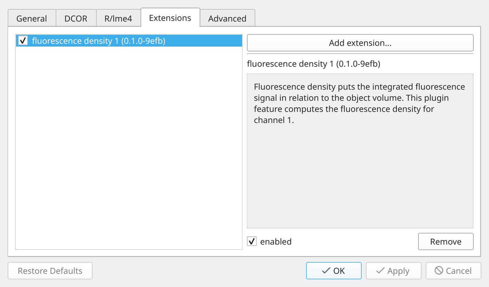

.. _sec_qg_extensions:

====================================
Loading Extensions (plugin features)
====================================
Since version 2.9.0, Shape-Out 2 allows loading dclab
:ref:`plugin features <dclab:sec_av_feat_plugin>`.
You may need those if you need to quantify anything that is not
covered by the :ref:`default features <dclab:sec_features>`.

.. note::
    If you installed Shape-Out via installer (not via `pip`), then
    many extensions might not work due to software dependencies that
    those extensions might have. If this happens, please create an
    issue in the Shape-Out 2 repository so we can find a solution.

.. warning::
    Extensions can be harmful. Please only load extensions that you
    received first-hand from people you trust.

You can load and manage extensions via the *Edit | Preferences* dialog in the
*Extensions* tab.

Example: Fluorescence density
-----------------------------
Download the :download:`extension_fl1_density.py <data/extension_fl1_density.py>`
extension and add it to Shape-Out. You will see a new scalar feature named
"FL-1 density [a.u.]" that quantifies the collected fluorescence signal
per object volume for the fluorescence channel 1. Using this extension as
a template, you could create the density features for the other fluorescence
channels as well.
