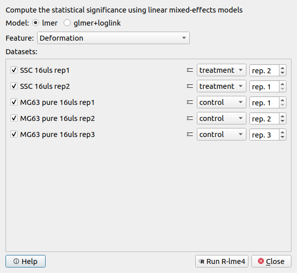
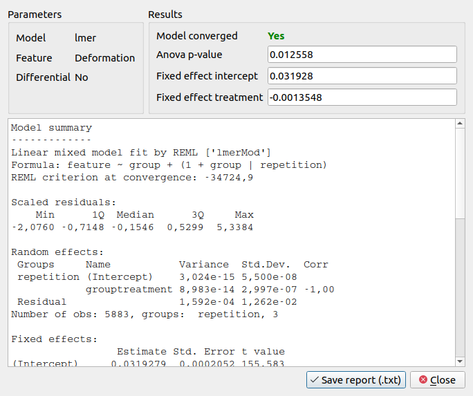
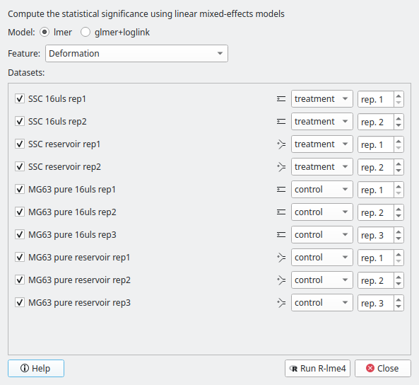
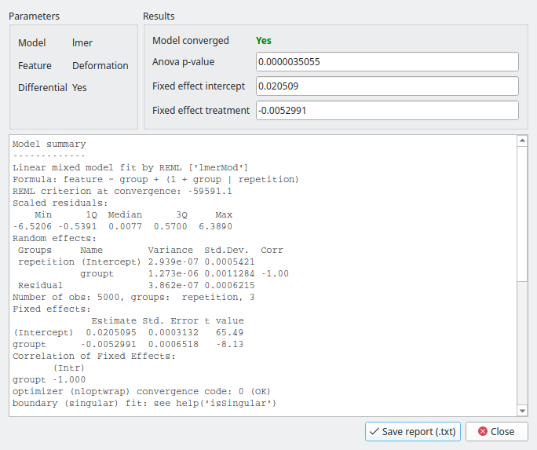

.. _sec_qg_lme4:

=============================================
Statistical significance testing (R and lme4)
=============================================
Since version 2.5.0, Shape-Out 2 allows you to quantify the statistical
significance (p-value) when comparing two measurement groups. For this to
work, you need to have R installed (tested with
`R 4.1.2 <https://cran.r-project.org>`_ ).
The analysis uses linear mixed effects models (LMM) as described
in :cite:`Herbig2018` and yields results identical to those obtained
with Shape-Out 1.

The LMM analysis is performed using the lme4 R package
and is based on the :ref:`implementation in dclab <dclab:sec_av_lme4>`
(please read for more information on the options available) which implements
a wrapper calling ``Rscript``.
Here, we make use of the dataset :cite:`FigshareLMM` to illustrate this
functionality.

Basic linear mixed models
-------------------------
We would like to quantify the difference between human skeletal stem cells
(SSC) and the human osteosarcoma cell line MG-63 (which is often used as a
model system for SSCs) using a likelihood ratio test based on LMM.

Please load :download:`this session <../tests/data/version_2_5_0_dcor_lme4.so2>`
into Shape-Out (via *File | Open Session*). The experimental data are accessed
from DCOR, so you will need a working internet connection. The session contains
five datasets:

- SSC_16uls_rep1_20150611.rtdc  (SSC repetition 1)
- SSC_16uls_rep2_20150611.rtdc  (SSC repetition 2)
- MG63_pure_16uls_rep1_20150421.rtdc  (MG-63 repetition 1)
- MG63_pure_16uls_rep2_20150422.rtdc  (MG-63 repetition 2)
- MG63_pure_16uls_rep3_20150422.rtdc  (MG-63 repetition 3)

.. note:: The data sets are ordered according to run index. In an ideal case,
    the run index would resemble the repetition of an experiment. Here,
    however, the run index is only an internal lab book reference.

In this example, we treat SSC as our "treatment" and MG-63 as our "control".
These are just group names that remind us that we are comparing one type of
sample against another type.

Note that the settings for Young's modulus computation have already been
defined and that the datasets are already filtered with these box filters:

- Porosity (*area_ratio*): 0 to 1.05
- Area [µm²] (*area_um*): 120 to 550
- Deformation (*deform*): 0 to 0.1

To perform an LMM analysis, go to *Compute | Statistical significance* and
set the groups (SSC: treatment; MG63: control) and repetitions (enumeration
by date-time).

Make sure that the feature "Deformation" is selected and hit *Run R-lme4*. The
results of the LMM analysis are shown in a new dialog.

The most important numbers are extracted from the report and are shown at
the top:

- **Fixed effect intercept:**
  The mean of the parameter chosen for all controls.

- **Fixed effect treatment:**
  The effect size of the parameter chosen between the mean
  of all controls and the mean of all treatments.

- **Anova p-value:**
  The p-value of the ANOVA test.

In the report, you will also find the **Full coefficient table**, which
shows the effect size of the parameter chosen between control and treatment
for every single experiment.

We are interested in the p-value, which is 0.01256 for
Deformation. We repeat the analysis with Area (0.0002183) and Young's
modulus (0.0002777). The p-values indicate that MG-63 (mean elastic
modulus 1.26 kPa) cells are softer than SSCs (mean elastic modulus 1.54 kPa)
:cite:`Herbig2018`.

LMM analysis of differential deformation
----------------------------------------
To check whether the deformation we see is not just an inherent deformation
(visible in the reservoir data), we would like to perform a differential feature
analysis.

Please load :download:`this session <../tests/data/version_2_5_0_dcor_lme4_diff.so2>`
into Shape-Out (via *File | Open Session*). The experimental data are accessed
from DCOR, so you will need a working internet connection. The session contains
ten datasets (reservoir measurements in addition to the measurements above).

As in the example above, go to *Compute | Statistical significance* and
set the groups and repetitions.

The results of the LMM analysis for differential deformation are:

The p-value for the differential deformation is magnitudes lower than the
p-value for the (non-differential) deformation in the previous example.
This indicates that there is a non-negligible initial deformation of the
cells in the reservoir.
