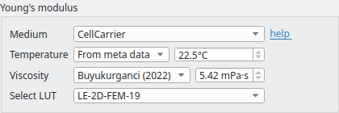
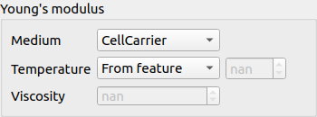
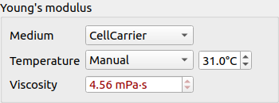
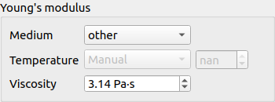
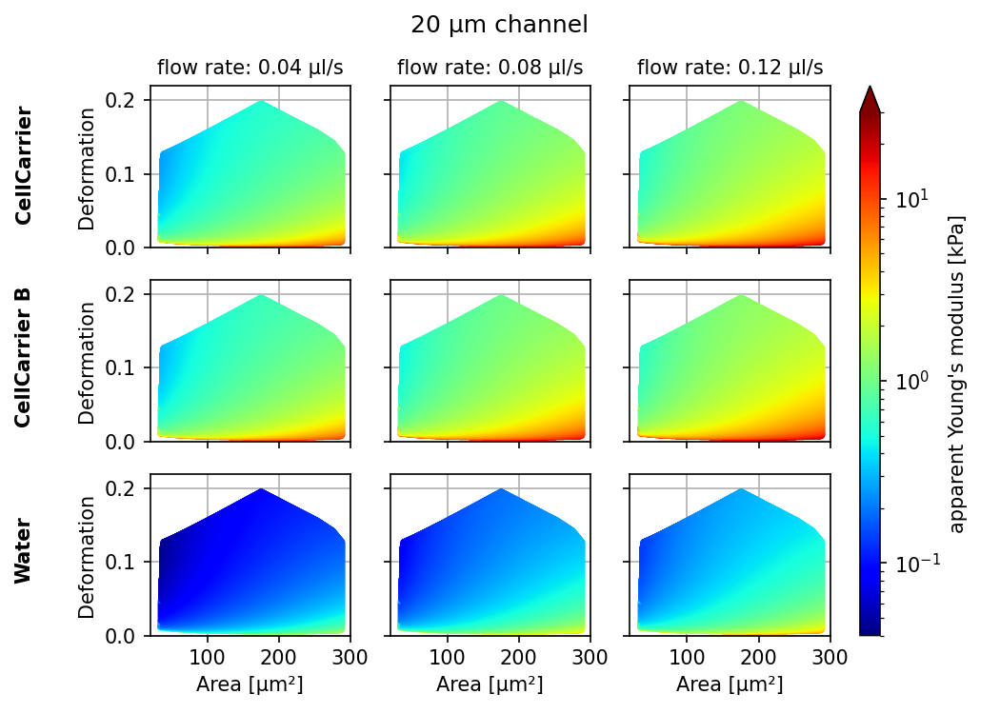
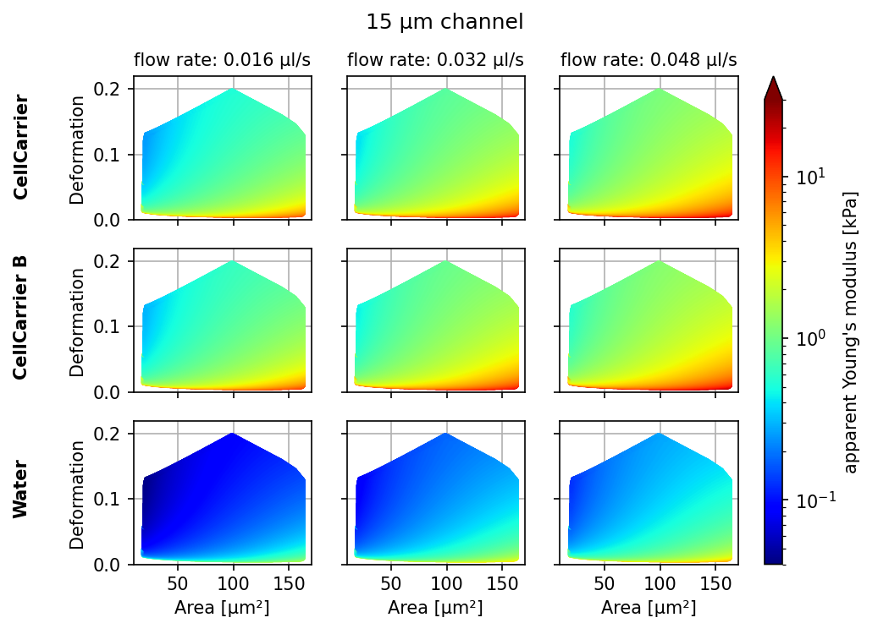
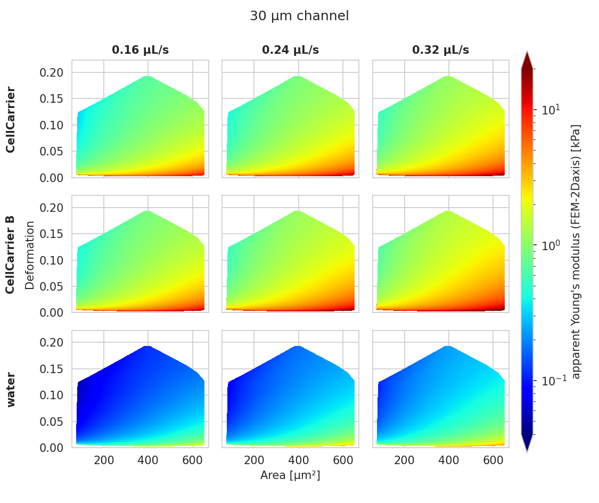

.. _sec_qg_youngs_modulus:

===============
Young's Modulus
===============
With Shape-Out, it is possible to translate the measured area and deformation
to the Young's modulus based on numerical simulation for
fully elastic spheres according to Mokbel et al. :cite:`Mokbel2017`.

The theoretical background, including the computation of the viscosity for
the MC-PBS media used in RT-DC, is discussed in more detail in the
:ref:`dclab docs <dclab:sec_av_emodulus>`.

.. note::

    For reservoir data, the Young's modulus cannot be computed. The
    corresponding options are hidden.

Parameter settings
------------------

.. _qg_emodulus_config:

    Temperature taken from the metadata.

.. _qg_emodulus_feature:

    Use the temperature (temp) feature.

The parameters for computing the Young's modulus can be set in the
*Dataset* tab of the :ref:`Analysis View <sec_analysis_view>`.
The Young's modulus is computed using a precomputed look-up table and
additionally depends on channel width, flow rate, pixel size (pixelation
correction), and viscosity. For known media, such as CellCarrier, the
viscosity can be derived from channel width, flow rate, and temperature.
In some RT-DC setups, the chip temperature is recorded during the measurement.
For instance, in :numref:`qg_emodulus_config`, the average chip temperature
of 22.5°C from the [setup] metadata section is used. The value of the
resulting viscosity is shown below.
If the chip temperature is recorded for each event, then the user may select
the *From feature* option (:numref:`qg_emodulus_feature`). In this case,
the Young's modulus is computed from the individual viscosities for each event. 

.. _qg_emodulus_badtemp:

    Temperature outside of known range.

If the temperature is not given as a feature or as metadata, then
you may select the temperature manually. This case is visualized in
:numref:`qg_emodulus_badtemp`. Here, the temperature is purposely set outside of
the known range defined in :cite:`Buyukurganci2022`, which is highlighted by
coloring the viscosity red.

.. _qg_emodulus_other:

    Manually set the viscosity.

You may also set the viscosity manually by selecting *other* as a medium
(:numref:`qg_emodulus_other`).
In this case, the values for temperature are irrelevant. Please only use
this option if you know what you are doing (e.g. you have considered
shear-thinning and temperature-dependence :cite:`Herold2017, Buyukurganci2022`).

Click *Apply* for any changes to take effect. The Young's modulus is then
available for the selected dataset.

.. note::

    In order to prevent users from doing a wrong analysis, Shape-Out does not
    allow users to change the buffer in the *Dataset* tab if the buffer medium
    (e.g. 0.59% MC-PBS) was selected in Shape-In or CytoShot. Therefore,
    the analysis of the Young's modulus cannot be re-done for a different
    buffer.

Bulk actions
------------
The *Bulk action* menu has an entry for Young's modulus computation.
In the associated dialog you can set the corresponding parameters
for all datasets of the current session. Note that the options
in this dialog do not necessarily reflect the options available for the
individual datasets. Only valid options are adopted. For instance,
you will not be able to change the medium for a dataset if a medium is
already given in its metadata. To verify the options set, you can always
check the current setting via the *Analysis View* (see above).

Validity
--------

The computation of the Young's modulus is valid only for objects that
initially have a spherical shape. In addition, the deformation and
size values must be in a "valid region". Events outside this region will
have a *nan*-valued (not a number) Young's modulus. Note that as a result,
these events will be excluded from all plots when *remove invalid events*
is checked in the *Filter* configuration tab.

    Visualizations of the support and the values of the look-up table (LUT)
    used for determining the Young's modulus from deformation and
    cell area. The values of the Young's moduli in the regions
    shown depend on the channel size, the flow rate, the temperature,
    and the viscosity of the medium :cite:`Mietke2015`.
    Here, they are computed for a 20 µm wide channel at 23°C with an
    effective pixel size of 0.34 µm. The viscosity of the MC-PBS buffers
    is computed according to :cite:`Buyukurganci2022` and the data are corrected
    for pixelation effects according to :cite:`Herold2017`.

The invalid regions (white in the figure above) include objects that
are very small or objects with very low deformation values.
The reason for that is a very steep increase of the Young's modulus with
little decrease in deformation that could potentially result in very large
simulation errors. In addition, regions with high deformation are invalid as well,
because the simulations do not converge (objects simulated with
lower Young's moduli  become more and more elongated until they rupture).
In practice, this means that the channel size has to be selected carefully
to match the object sizes. Larger object sizes require wider channels
if meaningful values for the Young's modulus are to be computed.

In the following, additional visualizations for other commonly used channel
sizes and flow rates are shown:

.. figure:: figures/qg_youngs_modulus_40um.png
    :target: _images/qg_youngs_modulus_40um.png

Implementation
--------------
As described above, the Young's modulus can be derived in multiple ways,
for known media and global or event-based temperature values.
The underlying implementation is described in the :ref:`dclab docs
<dclab:sec_av_emodulus>`.

