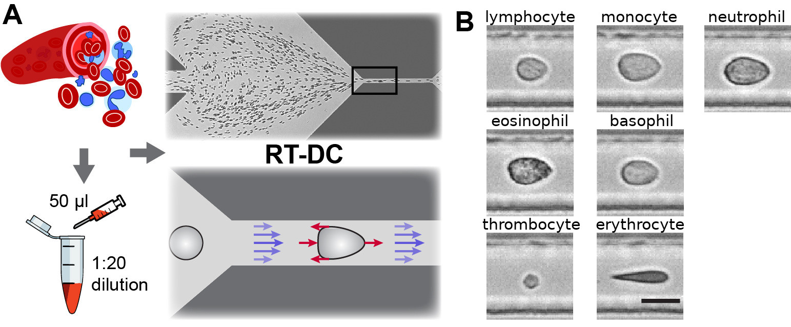
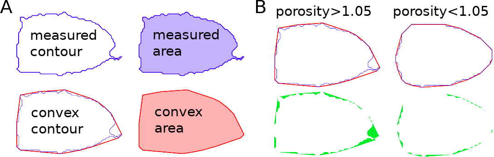
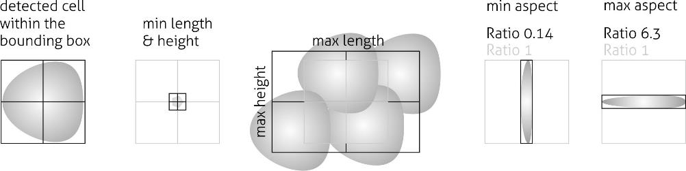
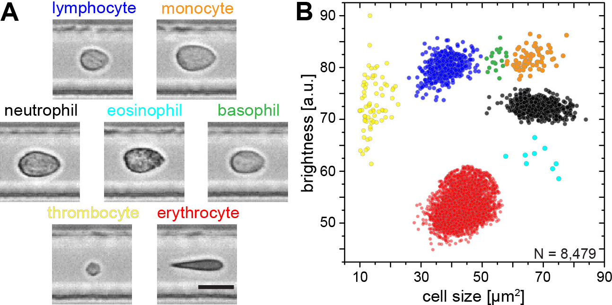
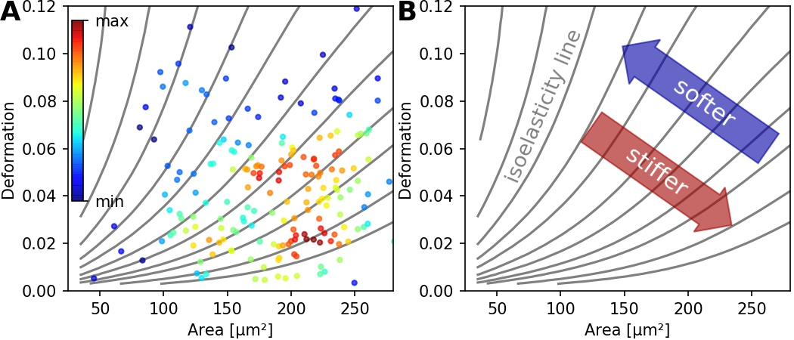
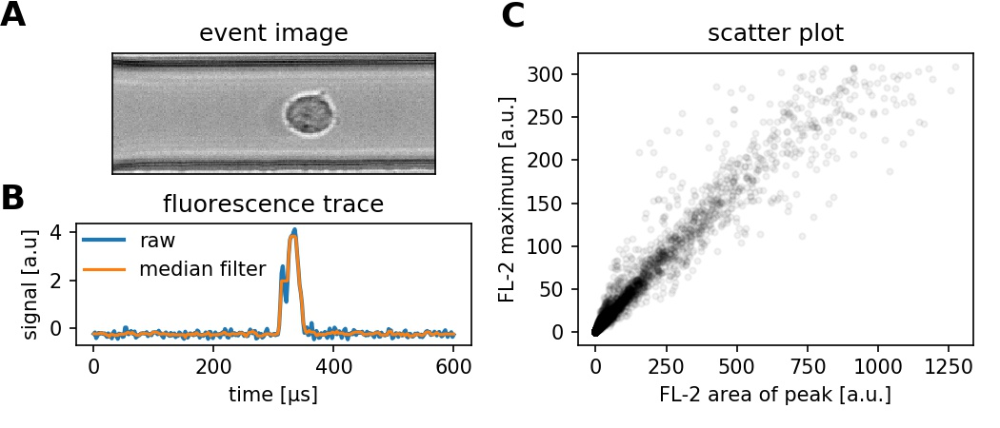
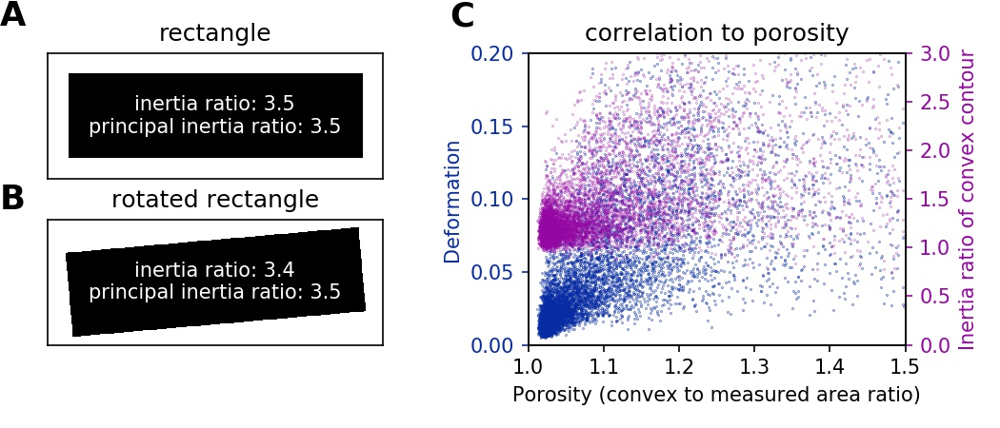
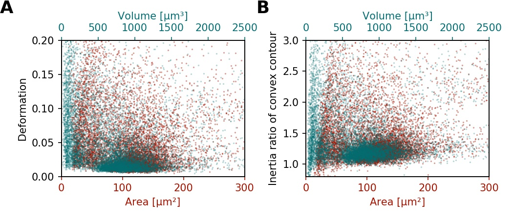

============
RT-DC Basics
============
This section conveys the basic understanding necessary for analyzing and
interpreting RT-DC data. If you have the feeling that something is not
covered here, please create an
`issue on GitHub <https://github.com/ZELLMECHANIK-DRESDEN/ShapeOut2/issues/new>`__.

Working Principle
=================
In Real-time deformability cytometry (RT-DC), small objects, such as cells
or beads, are flushed through a narrow channel at high speeds.
The flow profile inside the channel causes hydrodynamic stresses
that deform these objects :cite:`Mietke2015`, :cite:`Mokbel2017`.
For each event (detected object), an image is recorded and analyzed
in real-time :cite:`Otto2015`.
The analysis consists of the extraction of several features from the event
images, such as deformation, projected area, or average brightness.
These features can then be used to identify and characterize sample populations;
For instance, major blood cells and their pathological
changes in disease conditions :cite:`Toepfner2018`.

   Single-cell, morpho-rheological phenotyping of blood. (A) Analysis of
   whole, diluted blood. Hydrodynamic shear forces (red arrows) induce
   deformation of cells passing through a microfluidic channel (20x20 µm²)
   at speeds of more than 30 cm/s (blue arrows). (B) Representative images of
   blood cell types acquired. Scale bar is 10 µm.
   Figure and caption adapted from Toepfner et al. [1]_.

Measured Features
=================
A multitude of features can be extracted from the data recorded during an
RT-DC measurement. These features are mostly computed live during data
acquisition and are stored alongside the raw image data.
Here, only the most important features are discussed. A full list of the
features available in Shape-Out is maintained in the
:ref:`dclab documentation <dclab:sec_features>`.

Area and porosity
-----------------
The area is the projected object area which is determined via the contour of the
binarized event image. Shape-Out differentiates between two types of area,
area of the measured contour ("Measured area [px]") and area of the convex
contour ("Convex area [px]" and "Area [µm²]"). The convex contour is the
`convex hull <https://en.wikipedia.org/wiki/Convex_hull>`__ of the measured
contour and enables a quantification of porosity (convex to measured area ratio).
The porosity is often used for filtering, e.g. to
:ref:`remove high-porosity dirt particles in a preprocessing step
<sec_qg_filtering>`.

   Visualization of porosity. (A) The measured contour (blue line) defines
   the measured area (blue shade). The convex contour (red line) results
   in an area (red shade) that is usually larger than the measured area.
   (B) The porosity is the ratio between measured and convex contour. The
   difference (the "pores") between the measured and convex areas is
   indicated in green. Porosity is often used to remove events with
   non-physical contours, e.g. for cells all events with a porosity above 1.05.

A porosity of 1 means that the measured contour is convex.
Note that the porosity can only assume values larger than 1. Also note that the
convex contour/area is computed on the same pixel grid as the measured contour/area
and is, as such, subject to pixelation artifacts.

Bounding box
------------
The bounding box of an event image is the smallest rectangle (with its sides
parallel to the x and y axes) that can hold the event contour. The aspect
ratio of the bounding box is the rectangle's side length along x divided
by the side length along y. The size of the bounding box along x and y as
well as its aspect ratio are often used for filtering.

   Illustration of the event bounding box and its use cases. From left to
   right: definition of the bounding box, exclusion of small objects (e.g.
   debris) via the bounding box size, exclusion of clusters via the
   bounding box size, exclusion of objects elongated perpendicular to the
   channel axis, exclusion of objects elongated along the channel axis.

Brightness within contour
-------------------------
Quantifying the brightness values within the image contour yields
information on object properties such as homogeneity or density.
For instance, it has been shown that the quantities "mean brightness" and
"convex area" are sufficient to identify (and count) all major blood cells
in a drop of blood :cite:`Toepfner2018`.

   Blood-classification with event brightness and cell size.
   (A) Representative images of blood cell types acquired. Scale bar is 10 µm.
   (B) Brightness versus cell size (area) scatter plot with cell types labeled
   according to the color scheme in (A).
   Figure and caption adapted from Toepfner et al. [1]_.

In addition to the average
brightness values, Shape-Out also has access to the standard deviation of the
brightness in each image.

Deformation and elasticity
--------------------------
The deformation describes how much an event image deviates from a
circular shape. It is defined via the circularity:

.. math::

    \text{deformation} &= 1 - \text{circularity} \\
                       &= 1 - 2 \sqrt{\pi A} / l

with the projected area :math:`A` and the contour length of the convex hull
of the event image :math:`l`. The contour length is computed from the *convex*
hull to prevent an overestimation due to irregular, non-convex event shapes.
It has been shown that the knowledge of deformation and area allows to
derive a value for elasticity in RT-DC :cite:`Mietke2015` :cite:`Mokbel2017`.
As a convenient measure for elasticity, isoelasticity lines are often
employed to visualize stiffness.

   (A) Typical deformation versus cell size scatter plot. The color scale
   indicates event density.
   (B) Isoelasticity lines derived from numerical simulations indicate
   trends in stiffness.

Note that it is also possible to directly
:ref:`access the Young's modulus in Shape-Out <sec_qg_youngs_modulus>`.

Fluorescence
------------
Real-time fluorescence and deformability cytometry (RT-FDC) records, in
addition to the event images, the fluorescence signal of each event
:cite:`Rosendahl2018`. The raw fluorescence data consists of the
one-dimensional fluorescence intensity trace from which features such
as peak fluorescence or peak width can be computed. For more advanced
applications, RT-FDC also supports multiple fluorescence channels.

   (A) Event brightfield image. (B) Fluorescence trace of the event.
   The raw fluorescence data and the fluorescence data filtered with
   a rolling median filter (from which the parameters are computed)
   is shown.
   (C) Scatter plot of two parameters extracted from the fluorescence
   trace.

Inertia ratio
-------------
The inertia ratio is the ratio of the second order
`central moments
<https://en.wikipedia.org/wiki/Image_moment#Central_moments>`_ along
x and y computed for the event contour. Thus, the inertia ratio is a measure
of deformation. In contrast to deformation (which is computed from the
contour), inertia ratio is based on the integral over the cell area and thus
less prone to noise. In comparison to deformation, the inertia ratio has a low
correlation to porosity.
Shape-Out also allows to compute the principal inertia ratio which is the
maximal inertia ratio that can be obtained by rotating the contour. Thus,
the principal inertia ratio is rotation-invariant which makes it applicable
to reservoir measurements where e.g. cells are not aligned with the channel.
To quantify the alignment of the measured objects with the measurement
channel, Shape-Out can additionally quantify the tilt of the contour
relative to the channel axis.

   (A) For a rectangle that is aligned with the coordinate axes, the
   inertia ratio and the principal inertia ratio are identical.
   (B) If the rectangle is rotated, the inertia ratio changes, but the
   principal inertia ratio does not.
   (C) Comparison between deformation and inertia ratio when plotted
   against porosity for an exemplary RT-DC experiment. Deformation exhibits
   a higher correlation to porisity.

Volume
------
Shape-Out can compute the volume from the event contour under the assumption
of rotational symmetry, i.e. it is assumed that the projection of the cell
volume onto the detector plane does not change when the cell is rotated,
with a rotational axis parallel to the flow direction.
The computation of the volume is based on a full
rotation of the upper and the lower halves of the contour from which the
average is then used :cite:`Halpern2002`.
Volume has the advantage to be less correlated to deformation when compared
to the projected area and it is therefore a better measure of
cell size in the channel.

   (A) Deformation versus area (red) and volume (cyan) for an exemplary
   RT-DC dataset. There is a correlation between area and deformation,
   at least for small (<50µm²) areas. (B) Inertia ratio versus area and
   volume. A correlation between inertia ratio and area is visible as well.

.. [1] *Detection Of Human Disease Conditions By Single-Cell Morpho-Rheological
       Phenotyping Of Whole Blood* by Toepfner et al.,
       licensed under CC BY 4.0 :cite:`Toepfner2018`.
